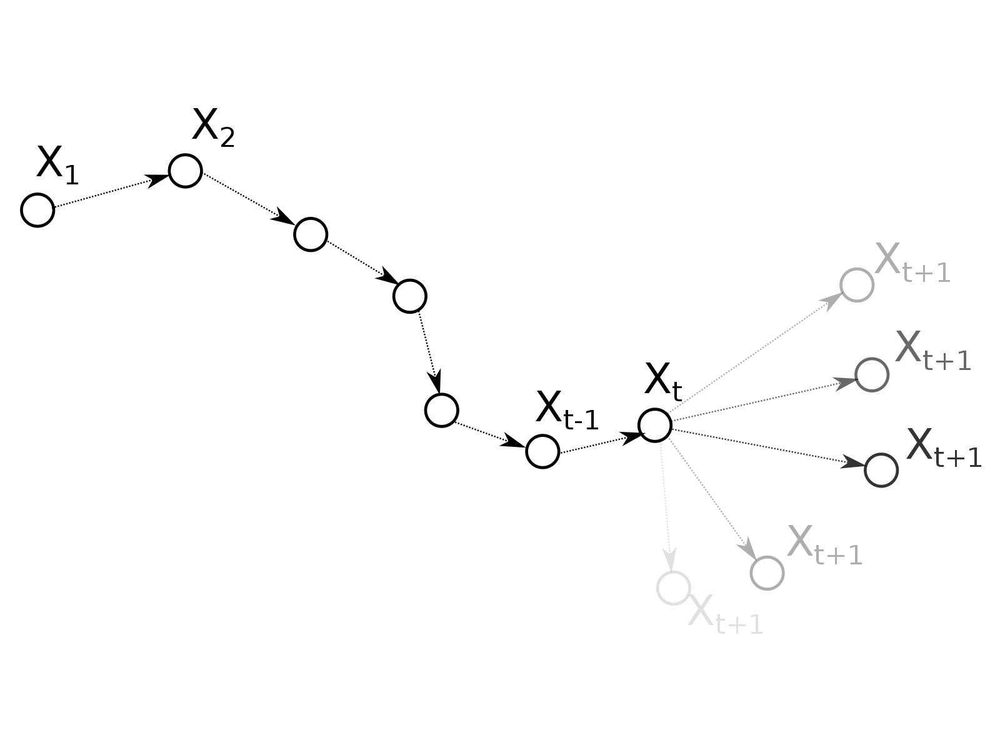
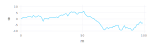
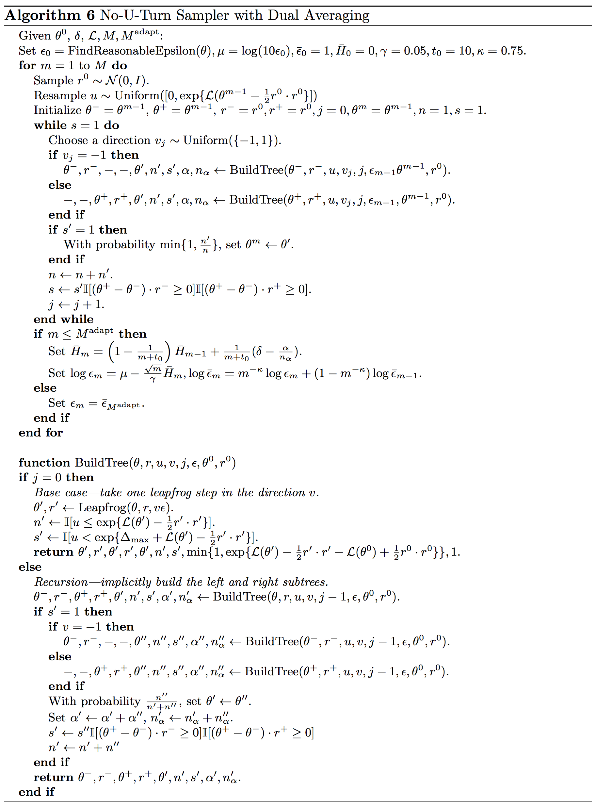
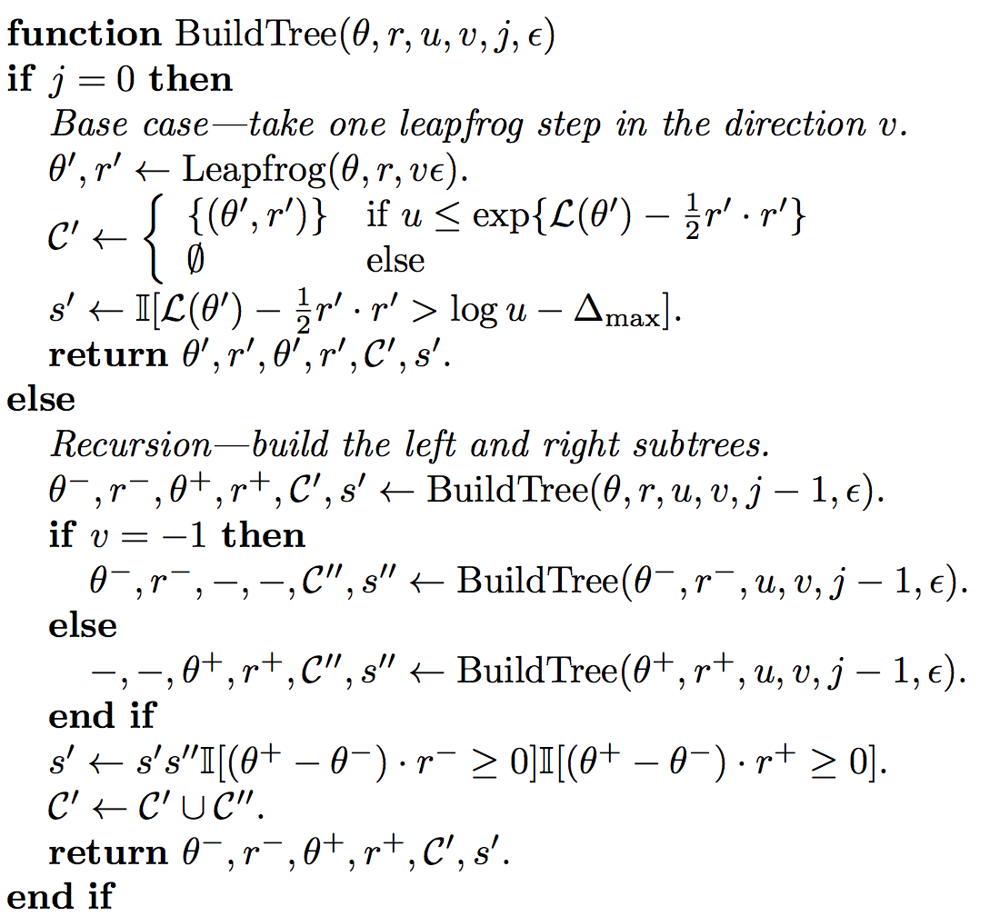

class: center, middle

### Julia Tokyo #2

# Juliaで学ぶ<br>Hamiltonian Monte Carlo

### NUTS入り

** 佐藤 建太 (Kenta Sato) **

**[@bicycle1885](https://twitter.com/bicycle1885)**

---

# コンテンツ

* 自己紹介
* マルコフ連鎖モンテカルロ法
* Metropolis-Hastings
* Hamiltonian Monte Carlo (HMC)
* No-U-Turn Sampler (NUTS)
* Juliaで使えるMCMCパッケージ

---

### こんなヒトのための発表です

* MCMCによるサンプリングをブラックボックスにしたくない
* Stanなどのサンプラーの原理を垣間見たい
* Juliaで使えるサンプラーを知りたい

---

### 注意

* 時間の都合上、MCMC自体は簡単に触れる程度です
* 数学的に厳密な話は期待しないで下さい
* 内容には細心の注意を払っていますが、専門外ゆえ間違いがあるかもしれません
* その時はその場で指摘していただけると助かります

---
class: center, middle

## 自己紹介 / パッケージ紹介

---

### 自己紹介

* 佐藤 建太
* Twitter/GitHub: @bicycle1885
* 所属: 東大大学院農学部
* 専門: Bioinformatics
* Julia歴: 今年の初め頃〜現在
* 好きな言語: Julia / Haskell
* よく使う言語: Python / R

---

### パッケージ紹介

#### DocOpt.jl - https://github.com/docopt/DocOpt.jl

ヘルプメッセージをパースし、コマンドライン引数のパースをする

#### RandomForests.jl - https://github.com/bicycle1885/RandomForests.jl

機械学習アルゴリズムRandom ForestのJulia実装


#### GeneOntology.jl - https://github.com/bicycle1885/GeneOntology.jl

生物学のGene Ontologyのツールキットを目指してる


---
class: center, middle

## マルコフ連鎖モンテカルロ法

---

### MCMC法とは

言わずと知れた、確率分布 \\( P(\mathbf{x}) \\) からのサンプルを**マルコフ連鎖**を用いて得るサンプリング手法のひとつ。

得られたサンプル自体は分布の期待値や分散など色々な値を計算するのに使われる。

マルコフ連鎖とは、現在の状態のみで次の状態の確率分布が決まる確率過程のことをいう。

$$ P(X\_{t+1} = x \mid X\_{1} = x\_{1}, \dots, X\_{t} = x\_{t}) = P(X\_{t+1} = x \mid X\_{t} = x\_{t}) $$

このとき、状態 \\(\mathbf{x}\\) から \\(\mathbf{x'}\\) へ遷移する確率を \\(T(\mathbf{x'} ; \mathbf{x})\\) と書き、**遷移確率**と呼ぶ。

???

マルコフ連鎖を決定する因子として、この遷移確率が非常に重要

---

### マルコフ連鎖の図

<figure>
    
    <figcaption>遷移確率 \( T(\mathbf{x'} ; \mathbf{x}) = P(X_{t+1} = \mathbf{x'} \mid X_{t} = \mathbf{x}) \)</figcaption>
</figure>

---

### 正しいMCMC

目的の確率分布 \\(\pi(\mathbf{x})\\) からサンプリングするには、遷移確率が満たさなければならない性質がある。

分布の不変性:

\\(\pi(\mathbf{x}) = \int T(\mathbf{x}; \mathbf{x'}) \pi(\mathbf{x'}) \mathrm{d}\mathbf{x'} \\)

エルゴード性:

\\(P^{(t)}(\mathbf{x}) \rightarrow \pi(\mathbf{x}) \, \text{as} \, t \rightarrow \infty, \, \text{for any} \, P^{(0)}(\mathbf{x})\\)

各サンプラーがこれらを満たすということの説明などは今日はしない(できない)。

---

### 高次元空間でのサンプリングは難しい

確率密度関数 \\(p(\mathbf x)\\) やその非正規化密度関数 \\(\tilde{p}(\mathbf x)\\) があるとする。

高次元空間でのサンプリングの難しさ

* \\( p(\mathbf{x}) \\) "濃い"領域は、空間上のごく一部に集中している
* しかしそれがどこかはサンプリング前には分からない

2つの戦略

1. その場から濃い方へ濃い方へと進み
2. 濃いところを見つけたらそこから薄いところへはあまり行かない

➠ MCMCはまさにそのような戦略をとる

---
class: center, middle

## Metropolis-Hastings

---

### Metropolis-Hastings

MCMCサンプリングのひとつで、**提案分布**というサンプリングしたい分布とは別の分布から候補点を取り出し、"良い値"ならその点を受理し、そうでなければその場にとどまる。

候補点を生成する提案分布 \\(q(\mathbf{\tilde{x}} \mid \mathbf{x})\\) は相関のない正規分布など、サンプリングしやすい分布に設定する。

候補点 \\(\mathbf{\tilde{x}}\\) は以下の確率 \\(A(\mathbf{\tilde{x}} \mid \mathbf{x}^{(m)})\\) で受理される:

$$ A(\mathbf{\tilde{x}} \mid \mathbf{x}^{(m)}) =
    \min\left(1, \frac{\tilde{p}(\mathbf{\tilde{x}}) q(\mathbf{x}^{(m)} \mid \mathbf{\tilde x})}{\tilde{p}(\mathbf{x}^{(m)})q(\mathbf{\tilde{x}} \mid \mathbf{x}^{(m)})})\right) $$

ここで、\\(\tilde{p}(\mathbf{x})\\) はサンプリングしたい分布 \\(p(\mathbf{x})\\) の非正規化密度関数

---

### Metropolis-Hastingsのアルゴリズム

非正規化確率分布関数 \\(\tilde{p}(\mathbf{x})\\) からサンプリングする

1. 初期状態 \\(\mathbf{x}^{(0)}\\) を決め、\\(m \gets 0\\) に設定する
2. 提案分布 \\(q(\mathbf{\tilde{x}} \mid \mathbf{x}^{(m)})\\) から新たな点 \\(\mathbf{\tilde{x}}\\) をとる
3. 確率 \\(A(\mathbf{\tilde{x}} \mid \mathbf{x}^{(m)})\\) で \\(\mathbf{\tilde{x}}\\) をサンプルとして受理し、そうでなければ棄却する
4. 受理された場合は \\(\mathbf{x}^{(m+1)} \gets \mathbf{\tilde x}\\) と設定し、棄却された場合は \\(\mathbf{x}^{(m + 1)} \gets \mathbf{x}^{(m)}\\) と設定する
5. \\(m \gets m + 1\\) として、2~4を \\(M\\) 個のサンプルが得られるまで繰り返す

---

提案分布は正規分布(`randn`)

```julia
#  p: (unnormalized) probability density function
# θ₀: initial state
#  M: number of samples
#  ϵ: step size
function metropolis(p::Function, θ₀::Vector{Float64}, M::Int, ϵ::Float64)
    d = length(θ₀)
    # allocate samples' holder
    samples = Array(typeof(θ₀), M)
    # set the current state to the initial state
    θ = θ₀
    for m in 1:M
        # generate a candidate sample from
        # the proposal distribution (normal distribution)
        θ̃ = randn(d) * ϵ + θ
        if rand() < min(1.0, p(θ̃) / p(θ))
            # accept the proposal
            θ = θ̃
        end
        samples[m] = θ
        print_sample(θ)
    end
    samples
end
```

---

### 呼び出し側

2変数の変数間に相関のある正規分布

```julia
# mean
μ = [0.0, 0.0]
# covariance matrix
Σ = [1.0 0.8;
     0.8 1.0]
# precision matrix
Λ = inv(Σ)
# unnormalized multivariate normal distribution
normal = x -> exp(-0.5 * ((x - μ)' * Λ * (x - μ))[1])
```

初期値`x₀`、サンプル数`M`、ステップ幅`ϵ`を指定してサンプリング

```julia
samples = metropolis(normal, x₀, M, ϵ)
```

---
layout: true

### 結果 - created with [Gadfly.jl](http://gadflyjl.org/)

---

<figure>
    
</figure>

---

<figure>
    
    
    
    
</figure>

---
layout: false

### Metropolis-Hastingsの問題点

1. 棄却率のトレードオフ
    * ステップサイズ \\( \epsilon \\) の値で、棄却率と性能のトレードオフがある
2. ランダムウォーク
    * サンプルの列がランダムウォークをする

---

### 問題1: 棄却率のトレードオフ

確率分布の値が集中してるのはごく一部だけ。

* ステップサイズ \\( \epsilon \\) 大 ➠ 大きく動けるが、棄却率が上がる
* ステップサイズ \\( \epsilon \\) 小 ➠ 棄却率は抑えられるが、あまり動けない

MCMCからなるべく独立なサンプルを得るにはステップサイズを大きくしたいが、棄却率が上がるためサンプリングの効率が悪くなるトレードオフがある。

次元(サンプリングする変数)によってパラメータ \\( \epsilon \\) の良い値が異なり、調節が難しい。

---

### 問題2: ランダムウォーク

Metropolis-Hastingsから得られたサンプル列は、ランダムウォークをしている

* 提案分布が提示する候補点 \\(\mathbf{\tilde{x}}\\) は、現在の値 \\(\mathbf{x}^{(m)}\\) からみて等方的
* \\(\mathbf{x}^{(m)}\\) が移動した先からすぐに戻ってきてしまうことがある
* ランダムウォークでは(おおまかに言って)反復回数の平方根に比例した距離しか進めない
* 空間を端から端まで渡るのにかなり反復回数が必要になる

<figure>
    
</figure>

---
class: center, middle

## Hamiltonian Mote Carlo (HMC)

---

### Hamiltonian Monte Carlo

**Hamiltonian Monte Carlo法(HMC)**は、ハミルトン力学(Hamiltonian dynamics)を元に考案されたMCMC法のひとつ。

* 確率密度関数の勾配を利用する (離散的な確率分布はできない)
* 空間での粒子の運動を追ってサンプルを得る
* 他のMCMCのアルゴリズムと比較して、相関の少ない良いサンプルが得られる
* この手法を発展させた**No-U-Turn Sampler (NUTS)**はStanというベイズ推定のためのプログラミング言語に実装されている

---

### Boltzmann分布

状態 \\( \mathbf{x} \\) のエネルギー \\(E(\mathbf{x})\\) と確率分布 \\(P(\mathbf{x})\\) は次のように関連付けられる。

$$ P(\mathbf{x}) = \frac{1}{Z} \exp{\left(-E(\mathbf{x})\right)} $$

ここで、 \\(Z\\) は確率分布の正規化定数である。

これを逆に使えば、確率分布のエネルギーが計算できる。

$$ E(\mathbf{x}) = -\log P(\mathbf{x}) - \log Z $$

---

### ハミルトン力学

粒子の運動を考える。\\(\mathbf{x}\\) を粒子の位置ベクトル、\\(\mathbf{p}\\) を運動量ベクトルとした時の粒子の運動を決めるハミルトン方程式:

$$
\begin{align}
\frac{\mathrm{d}x_i}{\mathrm{d}t} & = \frac{\partial H}{\partial p_i} \\\\
\frac{\mathrm{d}p_i}{\mathrm{d}t} & = - \frac{\partial H}{\partial x_i}
\end{align}
$$

ここで、ハミルトニアン \\(H(\mathbf{x},\mathbf{p})\\) はポテンシャルエネルギー \\(U(\mathbf{x})\\) と運動エネルギー \\(K(\mathbf{p})\\) の和として定義される。

$$ H(\mathbf{x}, \mathbf{p}) = U(\mathbf{x}) + K(\mathbf{p}) $$

---

### サンプリングへの応用

* 変数
    * 位置ベクトル \\(\mathbf{x}\\): サンプリングしたい確率変数
    * 運動量ベクトル \\(\mathbf{p}\\): 運動の補助的な変数
* エネルギー
    * ポテンシャルエネルギー \\(U(\mathbf{x})\\): Boltzmann分布を基に設定
    * 運動エネルギー \\(K(\mathbf{p})\\): 適当な運動エネルギーに設定

位置ベクトルと運動量ベクトルの同時分布 \\( P(\mathbf{x}, \mathbf{p}) \\) は \\(H(\mathbf{x}, \mathbf{p}) = U(\mathbf{x}) + K(\mathbf{p})\\) より以下のように分解できる。

$$ P(\mathbf{x}, \mathbf{p}) = \frac{1}{Z} \exp{\left(-H(\mathbf{x}, \mathbf{p})\right)} = \frac{1}{Z} \exp{\left(-U(\mathbf{x})\right)} \exp{\left(-K(\mathbf{p})\right)} $$

???

なので同時分布 \\(P(\mathbf{x}, \mathbf{p})\\) からサンプリングし、運動量ベクトル \\(\mathbf{p}\\) は捨てて位置ベクトル \\(\mathbf{x}\\) だけ集めれば良い。

---

### HMCのMetropolis基準

提示された候補点に関するMetropolis基準は以下のようになる。

$$ \alpha = \min{\left(1, \exp{\left\\{H(\mathbf{x}, \mathbf{p}) - H(\mathbf{\tilde{x}}, \mathbf{\tilde{p}})\right\\}}\right)} $$

理論的には、\\(H\\) の値は**不変**なので \\( H(\mathbf{x}, \mathbf{p}) - H(\mathbf{\tilde{x}}, \mathbf{\tilde{p}}) = 0\\) ゆえ必ず受理される (\\(\alpha = 1\\)) はずだが、コンピュータで数値的にハミルトン方程式を離散化して解くと必ず誤差が発生するため現実的には棄却率は**ゼロでない**。

---

### Leapfrog離散化

ハミルトン方程式は解析的に解くのは難しいので、数値積分を行う。
そこでは、**Leapfrog離散化**という以下の更新式をつかう。

$$
\begin{align}
p\_{i}\left(t + \epsilon / 2 \right) & = p\_{i}(t) - \frac{\epsilon}{2} \frac{\partial U(\mathbf{x}(t))}{\partial x\_{i}} \\\\
x\_{i}\left(t + \epsilon\right) & = x\_{i}(t) + \epsilon p\_i(t + \epsilon / 2) \\\\
p\_{i}\left(t + \epsilon\right) & = p\_{i}(t + \epsilon / 2) - \frac{\epsilon}{2} \frac{\partial U(\mathbf{x}(t + \epsilon))}{\partial x\_{i}}
\end{align}
$$


---

### なぜLeapfrog離散化なのか

* 同時分布 \\(P(\mathbf{x}, \mathbf{p})\\) を不変にするためには、\\(H(\mathbf{x}, \mathbf{p})\\) の体積を不変にしなければならない
* しかし、Euler法などでは(精度の悪さを無視しても)体積が変化してしまうので、 \\(P(\mathbf{x}, \mathbf{p})\\) が不変にならない
* Leapfrog離散化では、3つの更新式はそれぞれ**剪断写像(shear mapping)**なので、それぞれ適用しても体積が変化しない

<figure>
    
</figure>

.reference["VerticalShear m=1.25" by RobHar - Own work using Inkscape. Licensed under Public domain via Wikimedia Commons - http://commons.wikimedia.org/wiki/File:VerticalShear_m%3D1.25.svg#mediaviewer/File:VerticalShear_m%3D1.25.svg]

---

### HMCによるサンプリングアルゴリズム

1. 初期状態 \\(\mathbf{x}^{(0)}\\) を決め、\\(m \gets 0\\) に設定する
2. 運動量を正規分布などからサンプリングする
3. \\(\mathbf{x}^{(m)}\\) からステップサイズ \\(\epsilon\\) でLeapfrog離散化による更新を \\(L\\) 回繰り返し、\\(\mathbf{\tilde{x}}\\) を得る
4. 確率 \\(\min{\left(1, \exp{\left\\{H(\mathbf{x}, \mathbf{p}) - H(\mathbf{\tilde{x}}, \mathbf{\tilde{p}})\right\\}}\right)} \\) で受理し、そうでなければ棄却する
5. 受理された場合は \\(\mathbf{x}^{(m+1)} \gets \mathbf{\tilde{x}}\\) と設定し、棄却された場合は \\(\mathbf{x}^{(m+1)} \gets \mathbf{x}^{(m)}\\) と設定する
6. \\(m \gets m + 1\\) として、2~5を \\(M\\) 個のサンプルが得られるまで繰り返す

---

.font65[
```julia
#  U : potential energy function
# ∇U : gradient of the potential energy function
# θ₀ : initial state
#  M : number of samples
#  ϵ : step size
#  L : number of steps
function hmc(U::Function, ∇U::Function, θ₀::Vector{Float64}, M::Int, ϵ::Float64, L::Int)
    d = length(θ₀)
    # allocate sampels' holder
    samples = Array(typeof(θ₀), M)
    # set the current sate to the initail state
    θ = θ₀
    for m in 1:M
        # sample momentum variable
        p = randn(d)
        H = U(θ) + p ⋅ p / 2
        θ̃ = θ
        for l in 1:L
            p -= ϵ / 2 * ∇U(θ̃)  # half step in momentum variable
            θ̃ += ϵ * p          # full step in location variable
            p -= ϵ / 2 * ∇U(θ̃)  # half step in momentum variable again
        end
        H̃ = U(θ̃) + p ⋅ p / 2
        if randn() < min(1.0, exp(H - H̃))
            # accept the proposal
            θ = θ̃
        end
        samples[m] = θ
        print_sample(θ)
    end
    samples
end
```
]

---
layout: true

### 結果 - created with [Gadfly.jl](http://gadflyjl.org/)

---

<figure>
    
</figure>

\\(L = 10\\)

---

<figure>
    
    
    
    
</figure>

\\(L = 10\\)

---

<figure>
    
    
    
    
</figure>

\\(L = 1\\)

---

<figure>
    
    
    
    
</figure>

\\(L = 50\\)


---
layout: false

### HMCが解決したこと

エネルギーの勾配情報を使うことで、可能になったこと:

* ステップサイズ \\(\epsilon\\) を十分小さくとればLeapfrogの積分誤差が小さくなり、棄却率を低く抑えられる
* 粒子が \\(L\\) ステップ連続して滑らかに移動するため、ランダムウォークと比べて遠くまで動ける

棄却率を抑えつつ前の位置より遠くまで動くことができるようになり、得られるサンプルが**より独立なサンプル**に近づいた。

---

### HMCの難しさ

HMCの利点は、運動を調節する2つのパラメータ

* ステップサイズ \\(\epsilon\\)
* ステップ数 \\(L\\)

の値がちょうど良い値に設定されているということに依存している。

分布の形状によってちょうど良い値が変わるため、これらの値をどんな分布にもうまくいくよう予め設定するのは不可能。

---

### \\(\epsilon\\) と \\(L\\) の調整を間違えるとどうなるか

ステップサイズ \\(\epsilon\\):
* \\(\epsilon\\) が小さすぎる ➠ 粒子があまり動かない
* \\(\epsilon\\) が大きすぎる ➠ leapfrog離散化が荒すぎて棄却率が上がる

\\(\epsilon\\) を小さくすると \\(L\\) を大きくしないといけないため、計算コストもかかる。

ステップ数 \\(L\\):
* \\(L\\) が小さすぎる ➠ ランダムウォークをしてしまう
* \\(L\\) が大きすぎる ➠ 粒子が引き返す (Uターン)

➠ 自動的にパラメータを調節したい

---
class: center, middle

## No-U-Turn Sampler (NUTS)

---

### No-U-Turn Sampler

HMCはステップサイズ \\(\epsilon\\) とステップ数 \\(L\\) の2つのパラメータに敏感だったが、
**No-U-Turn Sampler (NUTS)**ではこれらのパラメータ(特に \\(L\\))をうまいこと調節してくれる。

* \\(\epsilon\\) の調節 ➠ サンプリング前のdual averagingにより最適化
* \\(L\\) の調節 ➠ サンプリング中の粒子の怪しい運動を検出して止まる

ヒトが手でパラメータのチューニングすることなく最適なHMCサンプラーと同じくら質の良いサンプルが得られるようになっている。

---

### 突然ですがNUTSのアルゴリズムです

<figure>
    
</figure>

.reference[Hoffman, M. D., & Gelman, A. (2014). The No-U-Turn Sampler : Adaptively Setting Path Lengths in Hamiltonian Monte Carlo, 15, 1351–1381.]

---

### NUTSの要点

さすがに全部を紹介するのは厳しいので要点を紹介すると、

* サンプル間の軌跡は、妥当な範囲で長い方がいい
* なので予め \\(L\\) を設定せず、軌跡をどんどん伸ばしていく
* 伸ばしすぎて運動がUターンを始めたら、軌跡を伸ばすのを止める
* その軌跡にあるデータ点から、新しいサンプルを得る
* 軌跡の延長やサンプリングは、詳細釣り合いを崩さないように

---

### 引き返しの基準

軌跡の長さの時間変化は、始点 \\(\mathbf x\\) から現在の点 \\(\mathbf{\tilde x}\\) までのベクトルと運動量ベクトル \\(\mathbf{\tilde p}\\) の積に比例する

$$ \frac{\mathrm d}{\mathrm d t} \frac{(\mathbf{\tilde x} - \mathbf x)^{\mathrm T}(\mathbf{\tilde x} - \mathbf x)}{2} = (\mathbf{\tilde x} - \mathbf x)^{\mathrm T} \frac{\mathrm d}{\mathrm d t}(\mathbf{\tilde x} - \mathbf x) = (\mathbf{\tilde x} - \mathbf x)^{\mathrm T}{\mathbf{\tilde p}} $$

この値が \\(0\\) 以下になったら、軌跡がUターンをし始めたことになる。

---

長いので気になる方はサンプルコードのnuts.jlを参照して下さい。

.font55[
```julia
#  L: logarithm of the joint density θ
# ∇L: gradient of L
# θ₀: initial state
#  M: number of samples
#  ϵ: step size
function nuts(L::Function, ∇L::Function, θ₀::Vector{Float64}, M::Int, ϵ::Float64)
    d = length(θ₀)
    samples = Array(typeof(θ₀), M)
    θ = θ₀
    for m in 1:M
        r₀ = randn(d)
        u = rand() * exp(L(θ) - r₀ ⋅ r₀ / 2)
        θ⁻ = θ⁺ = θ
        r⁻ = r⁺ = r₀
        C = Set([(θ, r₀)])
        j = 0
        s = 1
        while s == 1
            v = randbool() ? -1 : 1
            if v == -1
                θ⁻, r⁻, _, _, C′, s′ = build_tree(L, ∇L, θ⁻, r⁻, u, v, j, ϵ)
            else
                _, _, θ⁺, r⁺, C′, s′ = build_tree(L, ∇L, θ⁺, r⁺, u, v, j, ϵ)
            end
            if s′ == 1
                C = C ∪ C′
            end
            s = s′ * ((θ⁺ - θ⁻) ⋅ r⁻ ≥ 0) * ((θ⁺ - θ⁻) ⋅ r⁺ ≥ 0)
            j += 1
        end
        θ, _ = rand(C)
        samples[m] = θ
        print_sample(θ)
    end
    samples
end
```
]

---
layout: true

### 結果 - created with [Gadfly.jl](http://gadflyjl.org/)

---

<figure>
    
</figure>

---

<figure class="clearfix">
    
    
    
    
</figure>

---
layout: false
class: center, middle

# Juliaで使える<br>MCMCパッケージ

---

## Juliaで使えるMCMCパッケージ

* MCMC.jl - https://github.com/JuliaStats/MCMC.jl
    * サンプラーのデパート (12種類!)
    * ドキュメントがない
* Stan.jl - https://github.com/goedman/Stan.jl
    * Stanバインディング (via CmdStan)
    * そのうちMCMC.jlに取り込まれるっぽい?
* Mamba.jl - https://github.com/brian-j-smith/Mamba.jl
    * かなり本気っぽい純Julia製の実用的なMCMCフレームワーク
    * 充実のドキュメント

---

## まとめ

* HMCは粒子の運動を追跡してサンプリングすることにより、棄却率を下げられる
* NUTSはHMCの難しいパラメータ調節を、自動化してくれる
* Mamba.jlがJuliaの実用的なサンプラーの注目株か

---

## 参考

* Radford M.Neal. (2011). MCMC Using Hamiltonian Dynamics. In *Handbook of Markov Chain Monte Carlo*, pp.113-162. Chapman & Hall/CRC.
* C.M. Bishop. (2007). *Pattern Recognition and machine Learning*. Springer. (元田浩 (2012) サンプリング法 パターン認識と機械学習 下, pp.237-273. 丸善出版)
* 豊田秀樹 (2008). マルコフ連鎖モンテカルロ法 朝倉書店

---
class: center, middle

## おまけ

---

### Juliaのソースコードと擬似コードの異常な類似

.column-left[
.font65[
```julia
function build_tree(L::Function, ∇L::Function, θ::Vector{Float64}, r::Vector{Float64}, u::Float64, v::Int, j::Int, ϵ::Float64)
    if j == 0
        θ′, r′ = leapfrog(∇L, θ, r, v * ϵ)
        C′ = u ≤ exp(L(θ′) - r′ ⋅ r′ / 2) ? Set([(θ′, r′)]) : Set([])
        s′ = int(L(θ′) - r′ ⋅ r′ / 2 > log(u) - Δmax)
        return θ′, r′, θ′, r′, C′, s′
    else
        θ⁻, r⁻, θ⁺, r⁺, C′, s′ = build_tree(L, ∇L, θ, r, u, v, j - 1, ϵ)
        if v == -1
            θ⁻, r⁻, _, _, C″, s″ = build_tree(L, ∇L, θ⁻, r⁻, u, v, j - 1, ϵ)
        else
            _, _, θ⁺, r⁺, C″, s″ = build_tree(L, ∇L, θ⁺, r⁺, u, v, j - 1, ϵ)
        end
        s′ = s′ * s″ * ((θ⁺ - θ⁻) ⋅ r⁻ ≥ 0) * ((θ⁺ - θ⁻) ⋅ r⁺ ≥ 0)
        C′ = C′ ∪ C″
        return θ⁻, r⁻, θ⁺, r⁺, C′, s′
    end
end
```
]
]
.right-column[
<figure>

</figure>
]

---

### ハミルトニアンの不変性の証明

$$
\begin{equation}
\begin{split}
\frac{\mathrm{d}H}{\mathrm{d}t} & = \sum\_{i}\left\\{\frac{\partial H}{\partial x\_{i}} \frac{\mathrm{d} x\_{i}}{\mathrm{d} t} + \frac{\partial H}{\partial p\_{i}} \frac{\mathrm{d} p\_{i}}{\mathrm{d} t} \right\\} \\\\
    & = \sum\_{i}\left\\{\frac{\partial H}{\partial p\_{i}} \frac{\partial H}{\partial x\_{i}} - \frac{\partial H}{\partial p\_{i}} \frac{\partial H}{\partial x\_{i}} \right\\} = 0
\end{split}
\end{equation}
$$

