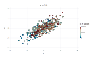
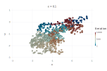
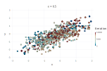
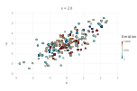
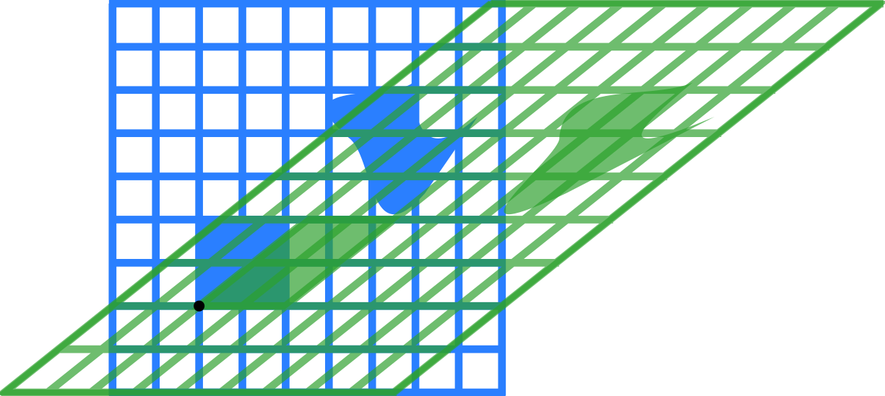
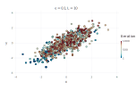
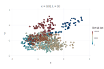
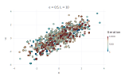

class: center, middle

### Julia Tokyo #2

# Juliaで学ぶHamiltonian Monte Carlo法

### 佐藤 建太 (Kenta Sato)

#### [@bicycle1885](https://twitter.com/bicycle1885)

---

# コンテンツ

* 自己紹介
* マルコフ連鎖モンテカルロサンプリング (MCMC)
    * 高次元空間からのサンプリングは難しい
    * Metropolis-Hastings
    * Metropolis-Hastingsの問題
* Hamiltonian Monte Carlo (HMC)
    * HMCのアイデア
    * HMCが解決したこと
    * HMCの難しさ
* No-U-Turn Sampler (NUTS)
    * NUTSの工夫

---

## こんなヒトのための発表です

* 最近話題のMCMCサンプリング手法を知りたい
* それをJuliaでどうやるのか知りたい

---

## 注意

* 時間の都合上、MCMC自体は簡単に触れる程度です
* 数学的に厳密な話は期待しないで下さい
* 内容には細心の注意を払っていますが、間違いがあるかもしれません
* その時はその場で指摘していただけると助かります

---
class: center, middle

# 自己紹介 / パッケージ紹介

---

## 自己紹介

* 佐藤 建太
* Twitter/GitHub: @bicycle1885
* 所属: 東大大学院農学部
* 専門: Bioinformatics
* Julia歴: 今年の初め頃〜現在
* 好きな言語: Julia / Haskell
* よく使う言語: Python / R

---
class: center, middle

# マルコフ連鎖モンテカルロサンプリング (MCMC)

---

## マルコフ連鎖モンテカルロサンプリング (MCMC)

確率分布 \\( P(\mathbf{x}) \\) からのサンプルを**マルコフ連鎖**を用いて得る手法

マルコフ連鎖とは、現在の状態のみで次の状態の確率分布が決まる確率過程

$$ P(X\_{n+1} = x \mid X\_{1} = x\_{1}, X\_{2} = x\_{2}, \dots, X\_{n} = x\_{n}) = P(X\_{n+1} = x \mid X\_{n} = x\_{n}) $$

---

## 高次元空間からのサンプリングは難しい

高次元サンプリングの難しさ

* \\( P(\mathbf{x}) \\) "濃い"領域は、空間上のごく一部に集中している
* しかしそれがどこかはサンプリング前には分からない

2つの戦略

1. その場から濃い方へ濃い方へと進み
2. 濃いところを見つけたらそこからあまり離れない

---

## Metropolis-Hastingsアルゴリズム

非正規化確率分布関数\\(\tilde{p}(\mathbf{x})\\)からサンプリングする

1. 初期状態 \\(\mathbf{x^{(0)}}\\) を決める
2. 提案分布 \\(q(\mathbf{\tilde{x}} \mid \mathbf{x^{(\tau)}})\\) から新たな点 \\(\mathbf{\tilde{x}}\\) をとる
3. 確率 \\(\alpha = \min\left(1, \frac{\tilde{p}(\mathbf{\tilde{x}}) q(\mathbf{x^{(\tau)} \mid \tilde{x}})}{\tilde{p}(\mathbf{x^{(\tau)}})q(\mathbf{\tilde{x} \mid x^{(\tau)}})}\right)\\) で \\(\mathbf{\tilde{x}}\\) をサンプルとして受容し、そうでなければ棄却する
4. 受容された場合は \\(\mathbf{x}^{(\tau+1)} \gets \mathbf{\tilde{x}}\\) と設定し、棄却された場合は \\(\mathbf{x}^{(\tau+1)} \gets \mathbf{x^{(\tau)}}\\) と設定する
5. 2~4を十分なサンプルが得られるまで繰り返す

この受理確率 \\(\alpha\\) を決める基準をMetropolis基準という。

---

### 提案分布

提案分布 \\(q(\mathbf{\tilde{x}} \mid \mathbf{x}^{(\tau)})\\) は基本的になんでも良いが、正規分布など容易にサンプリングできるものを選ぶ。

提案分布に対称性があるとき、特に**Metropolis**アルゴリズムなどと呼ばれる。

---

### 実装

```julia
# p:  (unnormalized) probability density function
# x0: initial state
# N:  the number of required samples
# ϵ:  step size
function metropolis(p::Function, x0::Vector{Float64}, N::Int, ϵ::Float64)
    d = length(x0)
    # allocate samples' holder
    samples = Array(typeof(x0), N)
    # set the current state to the initial state
    x = x0
    for n in 1:N
        # generate a candidate sample from
        # the proposal distribution (normal distribution)
        x̃ = randn(d) * ϵ .+ x
        if rand() < min(1.0, p(x̃) / p(x))
            # accept the proposal
            x = x̃
        end
        samples[n] = x
    end
    samples
end
```

ここでは、提案分布を正規分布(`randn`)とした。

---

### 呼び出し側

2変数の変数間に相関のある正規分布

```julia
    # mean
    μ = [0.0, 0.0]
    # covariance matrix
    Σ = [1.0 0.8; 0.8 1.0]
    # precision matrix
    Λ = inv(Σ)
    # unnormalized multivariate normal distribution
    normal = x -> exp((-0.5 * ((x .- μ)' * Λ * (x .- μ))))[1]
    # initial state
    x0 = [0.0, 0.0]
    for ϵ in [0.1, 0.5, 1.0, 2.0]
        srand(0)
        samples = metropolis(normal, x0, 1000, ϵ)
        ...
```

---
layout: true

### 結果 - created with [Gadfly.jl](http://gadflyjl.org/)

---

<figure>
    
</figure>

---

<figure>
    
    
    
    
</figure>

---
layout: false

## Metropolis-Hastingsの問題

---

### 問題1: 棄却率のトレードオフ

確率分布の値が集中してるのはごく一部だけ。

* ステップサイズ \\( \epsilon \\) 大 ➠ 大きく動けるが、棄却率が上がる
* ステップサイズ \\( \epsilon \\) 小 ➠ 棄却率は抑えられるが、あまり動けない

MCMCからなるべく独立なサンプルを得るにはステップサイズを大きくしたいが、棄却率が上がるためサンプリングの効率が悪くなるトレードオフがある。

次元(サンプリングする変数)によってパラメータ \\( \epsilon \\) の良い値が異なり、調節が難しい。

---

### 問題2: ランダムウォーク問題

* 提案分布が提示する候補点 \\(\mathbf{\tilde{x}}\\) は、現在の値 \\(\mathbf{x^{(\tau)}}\\) からみて等方的
* ランダムウォークでは(おおまかに言って)反復回数の平方根に比例した距離しか進めない
* 確率のある空間を端から端まで渡るのにかなり反復回数が必要になる

---
class: center, middle

# Hamiltonian Mote Carlo (HMC)

---

## Hamiltonian Monte Carlo (HMC)

**Hamiltonian Monte Carlo法(HMC)**は、ハミルトン力学(Hamiltonian dynamics)を元に考案されたMCMC法のひとつ。

* 確率密度関数の勾配を利用する (離散的な確率分布はできない)
* 確率変数が取りうる値の空間での粒子の運動を追って、サンプルを得る
* 他のMCMCのアルゴリズムと比較して、相関の少ない良いサンプルが得られやすい
* この手法を発展させた**No-U-Turn Sampler**はStanというベイズ推定のためのプログラミング言語に実装されている

---

### Boltzmann分布

状態 \\( \mathbf{x} \\) のエネルギー \\(E(\mathbf{x})\\) と確率分布 \\(P(\mathbf{x})\\) は次のように関連付けられる。

$$ P(\mathbf{x}) = \frac{1}{Z} \exp{\left(-E(\mathbf{x})\right)} $$

ここで、 \\(Z\\) は確率分布の正規化定数である。

これを逆に使えば、確率分布のエネルギーが計算できる。

$$ E(\mathbf{x}) = -\log P(\mathbf{x}) - \log Z $$

---

### ハミルトン力学

粒子の運動を考える。\\(\mathbf{x}\\) を粒子の位置ベクトル、\\(\mathbf{p}\\) を運動量ベクトルとした時の粒子の運動を決めるハミルトン方程式:

$$
\begin{align}
\frac{\mathrm{d}x_i}{\mathrm{d}t} & = \frac{\partial H}{\partial p_i} \\\\
\frac{\mathrm{d}p_i}{\mathrm{d}t} & = - \frac{\partial H}{\partial x_i}
\end{align}
$$

ここで、ハミルトニアン \\(H(\mathbf{x},\mathbf{p})\\) はポテンシャルエネルギー \\(U(\mathbf{x})\\) と運動エネルギー \\(K(\mathbf{p})\\) の和として定義される。

$$ H(\mathbf{x}, \mathbf{p}) = U(\mathbf{x}) + K(\mathbf{p}) $$

---

### サンプリングへの応用

* 変数
    * 位置ベクトル \\(\mathbf{x}\\): サンプリングしたい確率変数
    * 運動量ベクトル \\(\mathbf{p}\\): 運動の補助的な変数
* エネルギー
    * ポテンシャルエネルギー \\(U(\mathbf{x})\\): Boltzmann分布を基に設定
    * 運動エネルギー \\(K(\mathbf{p})\\): 適当な運動エネルギーに設定

位置ベクトルと運動量ベクトルの同時分布 \\( P(\mathbf{x}, \mathbf{p}) \\) は \\(H(\mathbf{x}, \mathbf{p}) = U(\mathbf{x}) + K(\mathbf{p})\\) より以下のように分解できる。

$$ P(\mathbf{x}, \mathbf{p}) = \frac{1}{Z} \exp{\left(-H(\mathbf{x}, \mathbf{p})\right)} = \frac{1}{Z} \exp{\left(-U(\mathbf{x})\right)} \exp{\left(-K(\mathbf{p})\right)} $$

???

なので同時分布 \\(P(\mathbf{x}, \mathbf{p})\\) からサンプリングし、運動量ベクトル \\(\mathbf{p}\\) は捨てて位置ベクトル \\(\mathbf{x}\\) だけ集めれば良い。

---

### HMCのMetropolis基準

提示された候補点に関するMetropolis基準は以下のようになる。

$$ \alpha = \min{\left(1, \exp{\left\\{H(\mathbf{x}, \mathbf{p}) - H(\mathbf{\tilde{x}}, \mathbf{\tilde{p}})\right\\}}\right)} $$

理論的には、\\(H\\) の値は**不変**なので \\( H(\mathbf{x}, \mathbf{p}) - H(\mathbf{\tilde{x}}, \mathbf{\tilde{p}}) = 0\\) ゆえ必ず受理される (\\(\alpha = 1\\)) はずだが、コンピュータで数値的にハミルトン方程式を離散化して解くと必ず誤差が発生するため現実的には棄却率は**ゼロでない**。

不変性の証明:

$$
\begin{equation}
\begin{split}
\frac{\mathrm{d}H}{\mathrm{d}t} & = \sum\_{i}\left\\{\frac{\partial H}{\partial x\_{i}} \frac{\mathrm{d} x\_{i}}{\mathrm{d} t} + \frac{\partial H}{\partial p\_{i}} \frac{\mathrm{d} p\_{i}}{\mathrm{d} t} \right\\} \\\\
    & = \sum\_{i}\left\\{\frac{\partial H}{\partial p\_{i}} \frac{\partial H}{\partial x\_{i}} - \frac{\partial H}{\partial p\_{i}} \frac{\partial H}{\partial x\_{i}} \right\\} = 0
\end{split}
\end{equation}
$$

---

### Leapfrog離散化

ハミルトン方程式は解析的に解くのは難しいので、数値積分を行う。
そこでは、**Leapfrog離散化**という以下の更新式をつかう。

$$
\begin{align}
p\_{i}\left(t + \epsilon / 2 \right) & = p\_{i}(t) - \frac{\epsilon}{2} \frac{\partial U(\mathbf{x}(t))}{\partial x\_{i}} \\\\
x\_{i}\left(t + \epsilon\right) & = x\_{i}(t) + \epsilon p\_i(t + \epsilon / 2) \\\\
p\_{i}\left(t + \epsilon\right) & = p\_{i}(t + \epsilon / 2) - \frac{\epsilon}{2} \frac{\partial U(\mathbf{x}(t + \epsilon))}{\partial x\_{i}}
\end{align}
$$

🐸

---

### 何故Leapfrog離散化なのか

* 同時分布 \\(P(\mathbf{x}, \mathbf{p})\\) を不変にするためには、\\(H(\mathbf{x}, \mathbf{p})\\) の体積を不変にしなければならない
* しかし、Euler法などでは(精度の悪さを無視しても)体積が変化してしまうので、 \\(P(\mathbf{x}, \mathbf{p})\\) が不変にならない
* Leapfrog離散化では、3つの更新式はそれぞれ**剪断写像(shear mapping)**なので、それぞれ適用しても体積が変化しない

<figure>
    
    <figcaption>剪断写像</figcaption>
    "VerticalShear m=1.25" by RobHar - Own work using Inkscape. Licensed under Public domain via Wikimedia Commons - http://commons.wikimedia.org/wiki/File:VerticalShear_m%3D1.25.svg#mediaviewer/File:VerticalShear_m%3D1.25.svg
</figure>


---

### HMCによるサンプリングアルゴリズム

1. 初期状態 \\(\mathbf{x^{(0)}}\\) を決める
2. 運動量を正規分布などからサンプリングする
3. \\(\mathbf{x^{(\tau)}}\\) からステップサイズ \\(\epsilon\\) でLeapfrog離散化による更新を \\(L\\) 回繰り返し、\\(\mathbf{\tilde{x}}\\) を得る
4. 確率 \\( \alpha = \min{\left(1, \exp{\left\\{H(\mathbf{x}, \mathbf{p}) - H(\mathbf{\tilde{x}}, \mathbf{\tilde{p}})\right\\}}\right)} \\) で受理し、そうでなければ棄却する
5. 受容された場合は \\(\mathbf{x}^{(\tau+1)} \gets \mathbf{\tilde{x}}\\) と設定し、棄却された場合は \\(\mathbf{x}^{(\tau+1)} \gets \mathbf{x^{(\tau)}}\\) と設定する
6. 2~5を十分なサンプルが得られるまで繰り返す

---

### 実装

```julia
#  u : potential energy function
# ∇u : gradient of the potential energy function
# x0 : initial state
#  N : the number of required samples
#  ϵ : step size
#  L : number of steps
function hmc(u::Function, ∇u::Function, x0::Vector{Float64}, N::Int, ϵ::Float64, L::Int)
    d = length(x0)
    # allocate sampels' holder
    samples = Array(typeof(x0), N)
    # set the current sate to the initail state
    x = x0
    for n in 1:N
        p = randn(d)
        h = u(x) + p ⋅ p / 2
        x̃ = x
        for l in 1:L
            p -= ϵ / 2 * ∇u(x̃)  # half step in momentum variable
            x̃ += ϵ * p          # full step in location variable
            p -= ϵ / 2 * ∇u(x̃)  # half step in momentum variable again
        end
        h̃ = u(x̃) + p ⋅ p / 2
        if randn() < min(1.0, exp(h - h̃))
            # accept the proposal
            x = x̃
        end
        samples[n] = x
    end
    samples
end
```

---
layout: true

### 結果 - created with [Gadfly.jl](http://gadflyjl.org/)

---

<figure>
    
</figure>

\\(L = 10\\)

---

<figure>
    
    
    
    
</figure>

\\(L = 10\\)

---
layout: false

## HMCが解決したこと

* ステップサイズ \\(\epsilon\\) を十分小さくとれば、棄却率を低く抑えられる
* 粒子が \\(L\\) ステップ連続して系統的に移動するため、ランダムウォークと比べて遠くまで動ける

棄却率を抑えつつ前の位置より遠くまで動くことができるようになり、得られるサンプルが**より独立なサンプル**に近づいた。

---

## HMCの難しさ

HMCの利点は、運動を調節する2つのパラメータ

* ステップサイズ \\(\epsilon\\)
* ステップ数 \\(L\\)

の値が良い値に設定されているということに依存している。

先ほどのサンプリングの結果から、HMCの性能はこれらのパラメータの値に極めて過敏になっていることが分かる。

---

### \\(\epsilon\\) と \\(L\\) の調整を間違えるとどうなるか

ステップサイズ \\(\epsilon\\):
* \\(\epsilon\\) が小さすぎる ➠ 粒子があまり動かない
* \\(\epsilon\\) が大きすぎる ➠ leapfrog離散化が荒すぎて棄却率が上がる

ステップ数 \\(L\\):
* \\(L\\) が小さすぎる ➠ ランダムウォークをしてしまう
* \\(L\\) が大きすぎる ➠ 粒子が引き返す (Uターン)


---
class: center, middle

# No-U-Turn Sampler (NUTS)

---

## No-U-Turn Sampler

HMCはステップサイズ \\(\epsilon\\) とステップ数 \\(L\\) の2つのパラメータに敏感だった。
**No-U-Turn Sampler (NUTS)**はこれらのパラメータをうまいこと調節して、最適なHMCサンプラーと同じくら質の良いサンプルが得られるようになっている。

---

## NUTSの工夫

---

# まとめ

---

# 参考

* Radford M.Neal. (2011). MCMC Using Hamiltonian Dynamics. In *Handbook of Markov Chain Monte Carlo*, pp.113-162. Chapman & Hall/CRC.
* C.M. Bishop. (2007). *Pattern Recognition and machine Learning*. Springer. (元田浩 (2012) サンプリング法 パターン認識と機械学習 下, pp.237-273. 丸善出版)
* 豊田秀樹 (2008). マルコフ連鎖モンテカルロ法 朝倉書店
